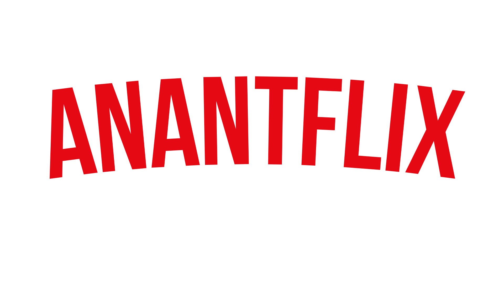

# 🎬 Anantflix - Platform Streaming Web

<p align="center">
  
</p>

**Anantflix** adalah platform streaming web yang menyediakan berbagai konten hiburan berkualitas tinggi untuk pengguna di seluruh dunia.

🌐 **Akses Web:** [Anantflix](https://anantflix.netlify.app/)

## ✨ Fitur Utama
- 🎥 **Streaming video berkualitas tinggi** – Nikmati pengalaman menonton tanpa gangguan.
- 🖥️ **Antarmuka pengguna yang ramah** – Desain intuitif untuk kemudahan navigasi.
- 🔍 **Rekomendasi konten personal** – Temukan film dan serial sesuai preferensi Anda.
- 📱 **Dukungan multi-perangkat** – Tonton di berbagai perangkat, kapan saja dan di mana saja.

## 🚀 Instalasi
Untuk menjalankan proyek ini secara lokal, ikuti langkah-langkah berikut:

```bash
# Clone repositori
git clone https://github.com/afifanant/anantflix.git

# Masuk ke direktori proyek
cd anantflix

# Instal dependensi
npm install

# Jalankan aplikasi
npm start
```

## 🛠️ Penggunaan
1. Buka browser dan akses **`http://localhost:3000`** atau langsung kunjungi [Anantflix](https://anantflix.netlify.app/).
2. **Daftar atau masuk** menggunakan akun Anda.
3. **Jelajahi dan nikmati** berbagai konten hiburan yang tersedia.

## 🤝 Kontribusi
Kami terbuka untuk kontribusi! Jika Anda ingin berkontribusi, silakan:
1. **Fork** repositori ini.
2. Buat branch baru (`feature-branch`).
3. Lakukan perubahan dan **commit**.
4. Kirimkan **Pull Request** untuk ditinjau.

## 📜 Lisensi
Proyek ini dilisensikan di bawah **MIT License** – silakan gunakan dan modifikasi sesuai kebutuhan.

## 📩 Kontak
Untuk pertanyaan atau dukungan, jangan ragu untuk menghubungi kami melalui:
📧 Email: [afifanant@gmail.com](mailto:afifanant@gmail.com)

---

### 🚀 Selamat Menikmati Anantflix! 🎉
